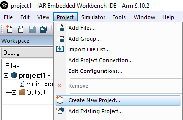
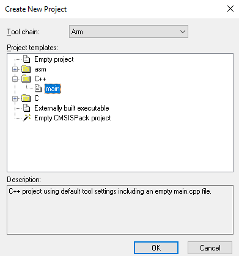
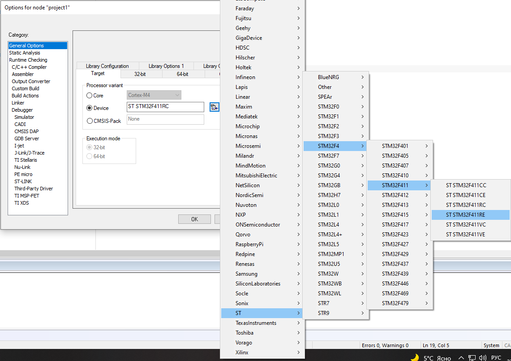

:imagesdir: Images
:figure-caption: Рисунок

== Лабораторная №0
=== Задание
Создать проект  *Lab1* под микроконтроллер *STM32F411RE* в IDE *IAR Embedded Workbench*, затем написать код программы, которая считает сумму двух *char* чисел (например *1* и *-6*, *10* и *250*).

=== Создадим проект в IAR Workbench
* Создадим новый проект Project => Create New Project.

.Создание нового проекта

=== Выберем шаблон проекта
* ProjectTemplates: C++ => main.

.Выбор шаблона проекта

=== Выберем микроконтроллера
* Сохраним проект под любым именем, например project1.
* В свойствах проекта выберем модель микроконтроллера ST => STM32F4 => STM32F411 => ST STM32F411RE. Для этого правой кнопкой мыши щелкнем по проекту, выберем Options и далее в категории General Option выберем вкладку Target.

.Выбор модели микроконтроллера
